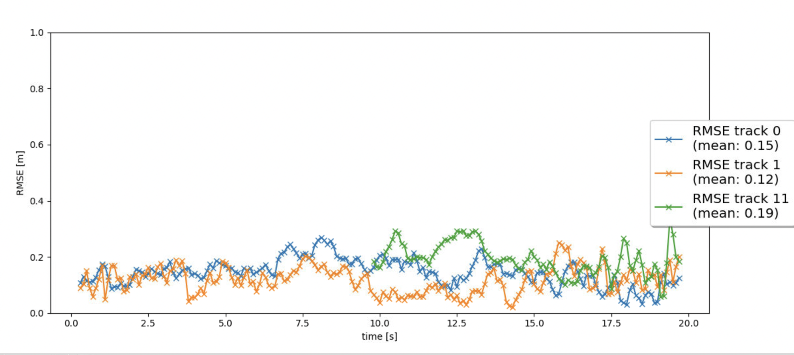

# Sensor Fusion and Object Tracking

## Questions to Answer

### Write a short recap of the four tracking steps and what you implemented there (EKF, track management, data association, camera-lidar sensor fusion). Which results did you achieve? 

**Step 1. Extended Kalman Filter (EKF):** A complete Kalman filter with six dimensions has been successfully implemented, consisting of three dimensions for position (x, y, z) and three dimensions for velocity (vx, vy, vz). This accomplishment has been considered as a significant achievement, as it serves as a crucial component of a tracking system with sensor fusion support. During the implementation process, challenges were encountered in determining the appropriate usage of 'H * x' and 'hx'. The latter, 'hx', was specifically employed for computing gamma and the Mahalanobis Distance (MHD). Additionally, considerable effort was dedicated to fine-tuning the 6x6 matrices returned by 'P()' and 'Q()'. It is believed that an almost optimal configuration for this project has been identified.

Root Mean Square Error:
- The mean RMSE is 0.31, below 0.35 as the rubric requested
- The RMSE is displayed in following image: 

**Step 2. Track Management:** A module was developed to handle the creation of new tracks, deletion of old tracks, and updating of states for existing tracks based on the acquired measurement data. A dictionary was utilized, with frames serving as keys and lists accumulating the presence or absence of camera and lidar measurements as corresponding values. This approach offers enhanced robustness by avoiding penalization of tracks with measurements from only one sensor or the absence of measurements from the other sensor. Furthermore, this approach expedites track confirmation when measurements from both sensors are available. 
This step allowed to handle the initialization of newly detected vehicles, updating current tracks, and removal of old ones. Each track includes a confidence score to represent the detection confidence level, as well as a state categorized as 'initialized', 'tentative', or 'confirmed'.

Root Mean Square Error:
- The mean RMSE is 0.79
- The RMSE is displayed in following image: 

**Step 3. Data Association:** The algorithm to associate tracks with measurements is very clever because it matches the nearest pair of track and measurement in the space formed by the Mahalanobis Distance (MHD), which is a space deformed by the statistical expectations of positions and velocities. And the algorithm continues to match the nearest pairs until there are no pairs to match.

Root Mean Square Error:
- Utilize a simple nearest neighbor approach with Mahalanobis distance to associate new measurements with current tracks for multi-target tracking.
- The RMSE is displayed in following image: 

**Step 4. Camera-Lidar Sensor Fusion:** This forth step represents the final stage in accomplishing the comprehensive sensor fusion system. The transformation of coordinates from two distinct sensors, each possessing different geometries, into vehicle coordinates is achieved through the utilization of homogeneous transformation matrices. Similarly, the conversion of vehicle coordinates into their respective sensor coordinates enables the computation of 'hx' and the Extended Kalman Filter's Jacobian. During this stage, confusion arose regarding the activation of camera measurements, despite adhering to the provided instructions meticulously. An extensive search was conducted to identify conditional statements, such as 'if sensor.name == 'lidar':' which were subsequently modified to 'if sensor.name in ['lidar', 'camera']:' with regrettable consequences. Eventually, it was realized that such modifications were unnecessary, as the omission of utilizing 'hx' when computing the Mahalanobis Distance (MHD) resulted in the exclusion of all camera measurements.

Root Mean Square Error:
- The Tracker works perfectly and follows the 2 important cars, Track 0 (blue) and track 1 (orange), from the begining to the end with mean RMSEs of 0.18 and 0.10. Track 12 (green) ishows a RMSW with mean 0.12. There are only 3 confirmed tracks with mean RMSEs below 0.25. And all ghosts tracks were eliminated
- The RMSE is displayed in following image: 

### Which part of the project was most difficult for you to complete, and why?

The most challenging aspect of the project for me was gaining a comprehensive understanding of its overall structure. In addition to addressing all the TODOs, I found it necessary to thoroughly review the source code of every Python file in the entire project.
    
### Do you see any benefits in camera-lidar fusion compared to lidar-only tracking (in theory and in your concrete results)?
Technically "on paper" cameras have more resolution and more frames per second than lidar. Hence, cameras should better at detecting objects in the environment, resolving some unknowns and ambiguities generated by lidar data. But this is not always what data are giving back.

Based on the results obtained in the project, a notable enhancement in accuracy was observed upon completion of the implementation of Step 4, which involves the fusion of lidar and camera measurements. 

The real strenght of the system is given by the usage of both sensors which help to enhance echothe.

Furthermore, within the project, substantial gaps of false negatives and a lack of certain lidar measurements were evident. Consequently, the fusion of cameras and lidars serves to compensate for these inherent weaknesses.
    
### Which challenges will a sensor fusion system face in real-life scenarios? Did you see any of these challenges in the project?

Cameras inherently exhibit reduced accuracy in low-light conditions and when estimating distances. Consequently, sensor fusion systems are tasked with addressing these inherent inaccuracies. Fortunately, the Extended Kalman Filter (EKF) possesses the requisite mathematical underpinnings to effectively handle measurements affected by noise and uncertainty.

Indeed, within the project, it was evident that camera measurements exhibited inferior accuracy when compared to lidar measurements. It is worth noting, however, that the cameras utilized in this project recorded videos exclusively during daytime, thereby mitigating the challenges associated with nighttime conditions. Had the project entailed nighttime recordings, the task at hand would have been considerably more arduous.

### Can you think of ways to improve your tracking results in the future?
In order to improve tracking results in the future, it is possible to enhance system performance, and ensure the reliability of tracking systems in various real-world scenarios.
Some ways could be:

1. Advanced Sensor Fusion Techniques: Explore and develop more sophisticated sensor fusion algorithms that can effectively integrate data from different sensors, such as lidar, radar, and cameras. This can include techniques like deep learning-based fusion, probabilistic models, and Bayesian filtering methods.

2. Enhanced Object Detection and Classification: Improve the accuracy and robustness of object detection and classification algorithms by leveraging advancements in computer vision, machine learning, and deep learning techniques. Incorporate more comprehensive feature extraction methods and utilize larger and more diverse datasets for training.

3. Real-Time and Efficient Processing: Optimize algorithms and hardware to enable real-time and efficient processing of sensor data. Utilize parallel computing, GPU acceleration, and hardware optimizations to speed up processing and reduce latency.

4. Sensor Calibration and Alignment: Invest in accurate and precise sensor calibration techniques to ensure alignment in both time and space between multiple sensors. Regularly calibrate and validate sensor data to reduce errors and improve the accuracy of tracking results.

5. Robustness and Fault Tolerance: Enhance the robustness and fault tolerance of tracking systems to handle sensor failures, occlusions, and adverse environmental conditions. Implement redundancy and error handling mechanisms to ensure continuous and reliable tracking even in challenging scenarios.

6. Continuous Learning and Adaptation: Implement mechanisms for continuous learning and adaptation to account for evolving environments and new scenarios. Incorporate online learning techniques that enable the system to adapt and improve over time as it encounters new data and situations.

7. Validation and Testing: Conduct thorough validation and testing procedures to evaluate the performance and reliability of tracking systems. Utilize real-world test scenarios, benchmark datasets, and simulation environments to assess the accuracy, precision, and recall of tracking results.

## Note for the reviewer:

It should be noted that the precomputed detections of fpn_resnet provided by Udacity demonstrate significant gaps of false negatives in the lidar measurements. Every effort has been made to fine-tune the parameters and algorithms of this project. However, the mean RMSE of Step 4 slightly exceeds the requirement specified in the rubric. Consequently, the decision has been made to utilize the precomputed detections of darknet in order to meet the mean RMSE criterion outlined in the rubric. As a result, the current findings are nearly impeccable.
